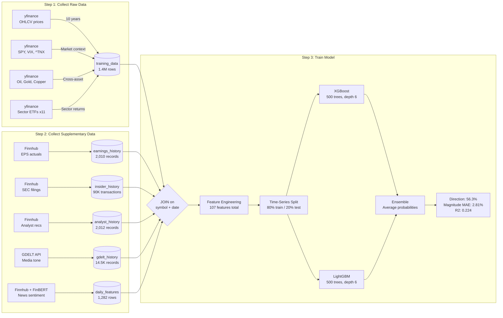
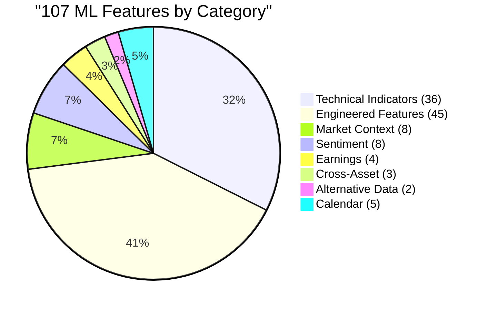
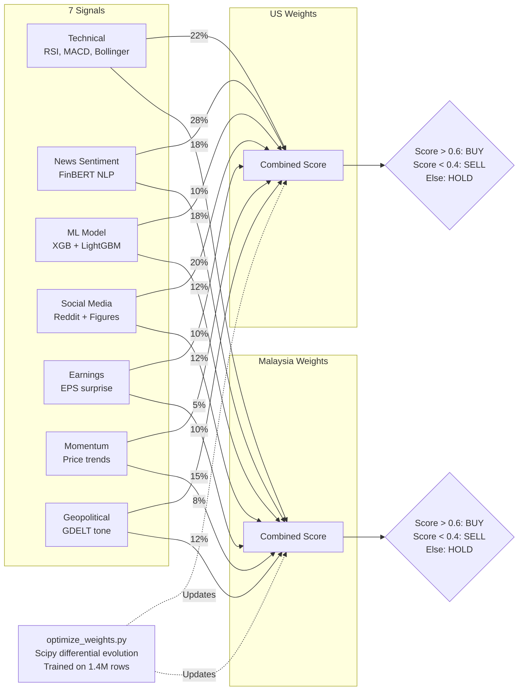
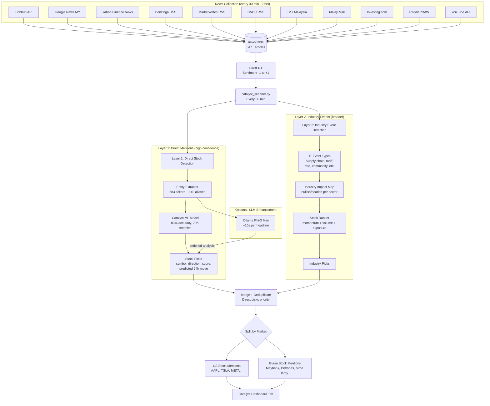
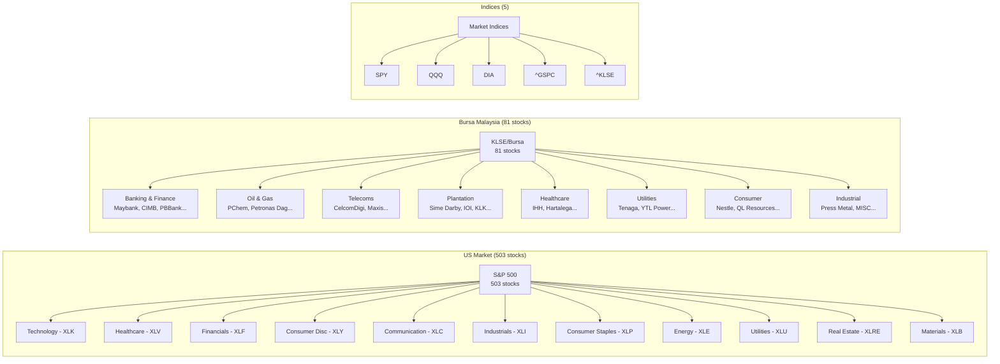
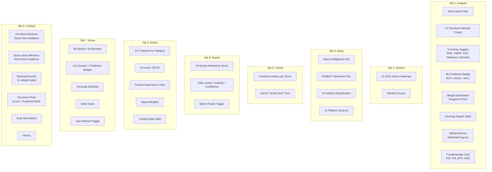

# StockSight — System Architecture

> Auto-updated by Claude Code. Last updated: 2026-04-10

---

## 1. Full System Overview

```mermaid
graph TB
    subgraph External Data Sources
        YF[Yahoo Finance<br/>yfinance - FREE]
        FH[Finnhub API<br/>60 req/min - FREE]
        RD[Reddit API<br/>PRAW - FREE]
        GD[GDELT<br/>Geopolitical - FREE]
        RSS[RSS Feeds<br/>6 feeds - FREE]
        YFRSS[Yahoo Finance<br/>News API - FREE]
        YT[YouTube API<br/>10K/day - FREE]
    end

    subgraph Data Collection Layer
        CH[collect_historical.py<br/>10yr OHLCV + macro]
        CE[collect_earnings.py<br/>EPS history]
        CI[collect_insider.py<br/>SEC filings]
        CA[collect_analyst.py<br/>Recommendations]
        CNH[collect_news_history.py<br/>Headline backfill]
        DC[daily_collector.py<br/>Daily sentiment]
        SC[social_collector.py<br/>Multi-source news]
        NT[news_tracker.py<br/>Live news poll]
        PT[price_tracker.py<br/>Price snapshots]
    end

    subgraph SQLite Database
        TD[(training_data<br/>1.4M rows, 587 stocks)]
        NW[(news<br/>547 articles, 11 platforms)]
        DF[(daily_features<br/>1,282 rows)]
        EH[(earnings_history<br/>2,010 records)]
        IH[(insider_history<br/>90,396 transactions)]
        AH[(analyst_history<br/>2,012 records)]
        GH[(gdelt_history<br/>14,552 records)]
        PR[(predictions<br/>cached results)]
        CAT[(catalyst_alerts<br/>event + stock picks)]
    end

    subgraph ML Models
        XGB[XGBoost<br/>Direction Classifier]
        LGBM[LightGBM<br/>Direction Classifier]
        XGBR[XGBoost<br/>Magnitude Regressor]
        CXGB[Catalyst XGBoost<br/>24h Reaction Model]
    end

    subgraph NLP Models
        FB[FinBERT<br/>Sentiment Analysis]
        OL[Ollama Phi-3 Mini<br/>Headline Analysis]
    end

    subgraph Analysis Engine
        PRED[predictor.py<br/>7-Signal Combiner]
        CATA[catalyst.py<br/>Event Detection +<br/>Stock Ranking]
        EE[entity_extractor.py<br/>583 tickers, 694 names,<br/>140+ aliases]
        LLM[llm_analyzer.py<br/>Ollama wrapper]
    end

    subgraph Flask Dashboard - 8 Tabs
        T1[Analysis Tab<br/>15 indicators, ML prediction]
        T2[Sectors Tab<br/>11 GICS heatmap]
        T3[News Tab<br/>AI classification]
        T4[Trends Tab<br/>Prediction history]
        T5[Report Tab<br/>Daily rankings]
        T6[Model Tab<br/>107 features, accuracy]
        T7[Bursa Tab<br/>80 stocks, watchlist]
        T8[Catalyst Tab<br/>US + Bursa picks]
    end

    YF --> CH & PT
    FH --> CE & CI & CA & NT & CNH
    RD --> DC
    GD --> DC
    RSS --> SC
    YFRSS --> SC
    YT --> SC

    CH --> TD
    CE --> EH
    CI --> IH
    CA --> AH
    CNH --> DF
    DC --> DF & GH
    SC --> NW
    NT --> NW
    PT --> PR

    TD & DF & EH & IH & AH & GH --> XGB & LGBM & XGBR
    NW & TD --> CXGB

    FB --> NW
    OL --> LLM

    XGB & LGBM --> PRED
    CXGB --> CATA
    EE --> CATA
    LLM --> CATA

    PRED --> T1 & T5 & T7
    CATA --> T8
    NW --> T3
    PR --> T4
    TD --> T6
```

---

## 2. Data Flow: How the AI Gets Training Data

---

## 3. Feature Breakdown: What the AI Learns From (107 Features)

### Feature Details

| Category | Count | Source | Examples |
|----------|-------|--------|----------|
| **Base OHLCV + Indicators** | 36 | yfinance | RSI, MACD, Bollinger, Ichimoku, ADX, ATR, OBV, VWAP, CCI, PSAR |
| **Engineered** | 45 | Computed | Lagged RSI/MACD/volume (x3 lags), momentum 5d/20d, 52-week position, streaks, EMA convergence, BB width, relative strength, Fear & Greed proxy, cross-asset correlations |
| **Market Context** | 8 | yfinance | SPY close, VIX, Treasury 10Y/2Y, yield spread, DXY, sector ETF return |
| **Sentiment** | 8 | Finnhub + FinBERT + GDELT | News sentiment, Reddit sentiment, figure sentiment, GDELT tone, Fear & Greed |
| **Earnings** | 4 | Finnhub | EPS surprise %, days since earnings, beat rate (4Q), earnings momentum |
| **Cross-Asset** | 3 | yfinance | Oil (CL=F), Gold (GC=F), Copper (HG=F) close prices |
| **Alternative** | 2 | Finnhub | Insider buy ratio (90-day), analyst consensus score |

---

## 4. Signal Weights: How Prediction Score is Calculated

---

## 5. Catalyst System: News → Stock Prediction Pipeline

---

## 6. Stock Universe Coverage

---

## 7. Dashboard: What Users See (8 Tabs)

---

## 8. Scheduled Services (6 Workers)

```mermaid
gantt
    title Scheduled Workers Timeline (24h)
    dateFormat HH:mm
    axisFormat %H:%M

    section Every 5 min
    Price Tracker           :crit, 00:00, 5m
    Price Tracker           :crit, 00:05, 5m
    Price Tracker           :crit, 00:10, 5m

    section Every 30 min
    News Tracker            :active, 00:00, 10m
    Catalyst Scanner        :active, 00:15, 5m
    News Tracker            :active, 00:30, 10m
    Catalyst Scanner        :active, 00:45, 5m

    section Every 2 hours
    Social Collector        :00:10, 15m
    Social Collector        :02:10, 15m

    section Daily
    Daily Collector         :milestone, 18:00, 30m
    Batch Predict           :milestone, 18:30, 60m
    DB Backup               :02:00, 5m
```

---

## 9. Model Accuracy Summary

| Model | Purpose | Data | Accuracy | Top Features |
|-------|---------|------|----------|-------------|
| **Main Direction** | 5-day UP/DOWN/FLAT | 1.4M rows, 107 features | **56.3%** | volatility, vix_high, market_index, oil_close |
| **Main Magnitude** | 5-day % change | same | **MAE 2.81%** | same |
| **Catalyst Direction** | 24h reaction to news | 70K samples, 16 features | **83.0%** | sentiment_positive, is_direct_mention, has_event |
| **Catalyst Magnitude** | 24h % move | same | **MAE 2.01%** | same |
| **FinBERT** | Headline sentiment | Pre-trained (ProsusAI) | ~90% | — |
| **Ollama Phi-3** | Deep headline analysis | Pre-trained (Microsoft) | — | — |
